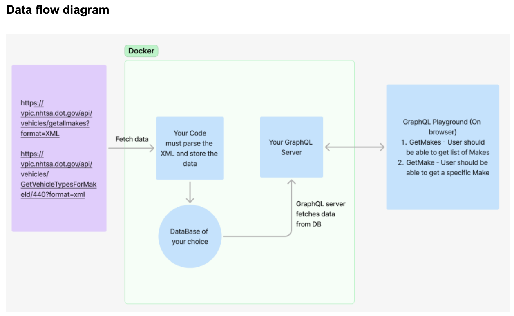

# GraphQL Coding Challenge

Hard Requirements:
● Service must parse XML
○ Parse all the Makes from:
https://vpic.nhtsa.dot.gov/api/vehicles/getallmakes?format=XML
○ Get all the Vehicle Types per Make:
https://vpic.nhtsa.dot.gov/api/vehicles/GetVehicleTypesForMakeId/440?format=x
ml
● Service must produce JSON
○ Combine all the of XML information into a single JSON object
○ Produce an array of objects with all the information from the XML endpoints
● The JSON must look like the following:
○ https://gist.github.com/mbaigbimm/d340e7800d17737482e71c9ad1856f68
● Service must save this transformed data into a persistent datastore
● Service must expose a single GraphQL endpoint to access the transformed data
○ Query all makes with all vehicle types (hint: look to improve performance)
○ Query a single make with vehicle types
● Service must contain tests for each data transformation
● Service must follow NodeJS best practices for project structure, and code
● Service must use TypeScript
● Service must by Dockerized
Nice to have:
● Build the service using NestJS
● Build a CI pipeline to build the Service image including a step for your preferred linter
and tests.
NOTE: If the service is unavailable, please use the attached dataset. For
VehicleTypesforMakeId you may create fake data associated with each Make Id following the
example provided.

